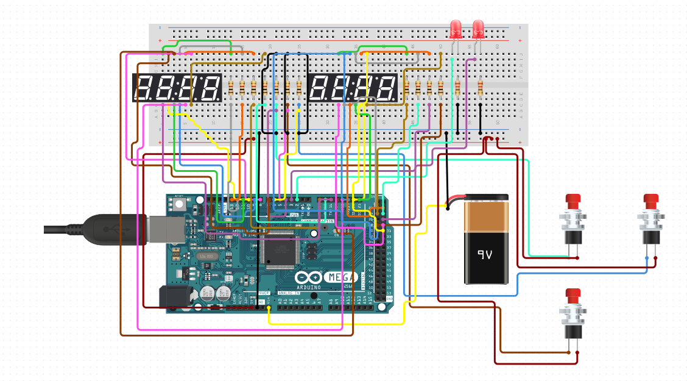

# archclk -Arduino Chess Clock

A simple but functional chess clock made with arduino nano and a few components.

## Features

- 12 Game modes.
- Game mode select, pause, and reboot.
- Win/Loose state.
- Current turn indicator.

## Game modes.

	- Bullet 1 + 0
	- Bullet 2 + 1
	- Blitz 3 + 0
	- Blitz 3 + 2
	- Blitz 5 + 0
	- Blitz 5 + 3
	- Rapid 10 + 0
	- Rapid 10 + 5
	- Rapid 15 + 10
    - Classical 30 + 0
    - Classical 30 + 20
    - Classical 60 + 0	

## Components used

- BreadBoard - Half Size - $4.5 x Qty: 1
- Arduino Nano - R3 $22 x Qty: 1
- 9v Battery - $1.88 x Qty: 1
- Momentary Push Button - Panel Mount - $3.06 x Qty: 3
- 10K Ohm Resistor - $0.1 x Qty: 3 
- LED - Basic Red 5mm $0.36 x Qty: 2
- 220 Ohm Resistor - $0.1 x Qty: 2
- USB Mini-B Cable - 6 Foot - $3.11 x Qty: 1 - 
- Jumper Wires Pack - M/M - $1.95 x Qty: 1
- Jumper Wires Pack - M/F - $1.95 x Qty: 1

* Prices are estimated.

# Schematics

